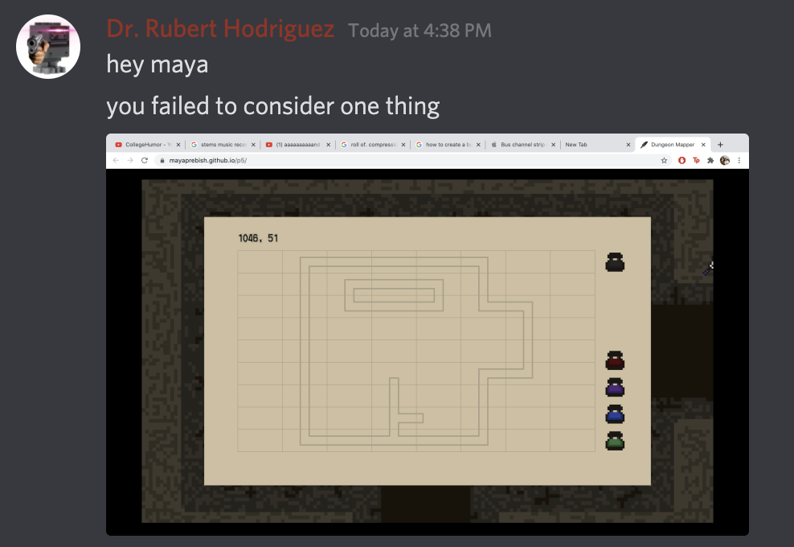
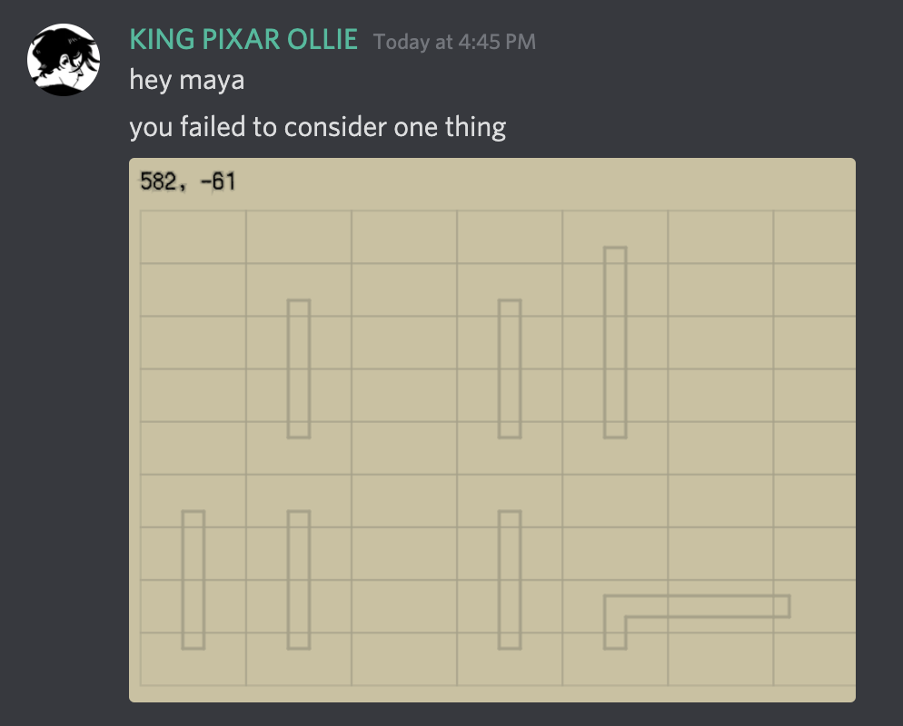

# Dungeon Mapper
#### A game about an explorer meticulously mapping out a dungeon. [Play here!](https://mayaprebish.github.io/dungeonmapper)

### Dev Log
April 10 2021:
> Decided I wanted to make a dungeon crawler.

> Started planning and experimenting with Processing 3, a language/IDE I had fun using in my high school CS courses

April 11-19 2021:
> Decided I wanted to create a dungeon mapping mechanic.

> Created data types for map cells/dungeon screens, and helper functions for walking, switching screens, animating the player, drawing backgrounds, opening the map, changing pen colors, etc.

> Drew a whole bunch of pixel art.

> Created map door-drawing functionality.

April 20 2021:
> Started the transition to p5.js, so I could host the game on my portfolio.

April 22 2021:
> Asked my friends to playtest. This went about as well as I could expect.

